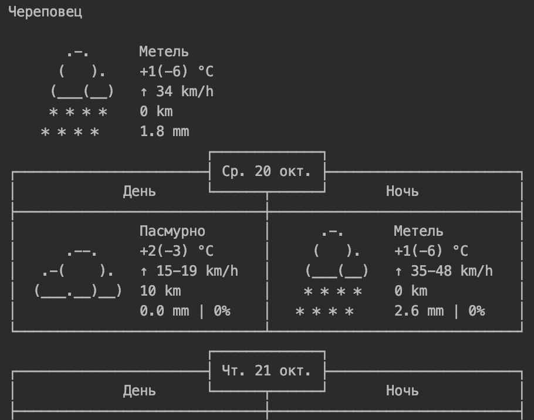

# Console-Weather
Just a simple funny console *python* app that shows weather in London, Sheremetyevo and Сherepovets:sun_behind_rain_cloud::umbrella:  
Uses [*wttr.in*](https://github.com/chubin/wttr.in) API.

  
  

### How to install and run
Python3 should already be installed. Then open terminal window and install dependencies:  
```
pip install -r requirements.txt
```
And enjoy!)
```
python3 weather.py
```
